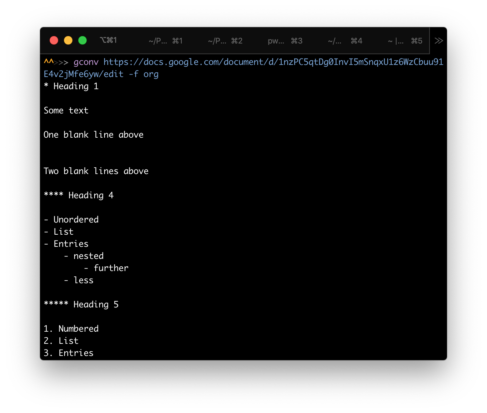

# Google Docs Converter
> Command Line app to convert Google Docs documents into Markdown or Org plain text formats.

Google Docs Converter (gconv) is a command line utility that takes a Google Docs URL and converts the document into either [Markdown][] or [Org Mode][] formats. It's written in Typescript for Node.js and requires a credentials.json file from your Google Developer account.



## Installation

### OS X & Linux

```sh
npm install -g google-docs-converter
```

You'll also need to place a `credentials.json` file from your Google Developer Account in the folder `~/.config/google-docs-converter/`.

The easiest way to get the necessary credentials is at the [Google Docs API Node.js Quickstart page][quickstart]. There you can automatically generate the credentials by hitting the "Enable the Google Docs API" button, selecting Desktop app, and then clicking "DOWNLOAD CLIENT CONFIGURATION". You can then take that credentials.json file and move it to `~/.config/google-docs-converter/`.

Alternatively you can create your own project with the [Google Cloud Console][], enable the Google Docs API, and create OAUTH credentials for a Desktop or Other type application, then download those credentials.

### Windows

` ¯\_(ツ)_/¯ `

## Usage

This app was created because I often work in Google Docs with a partner, but when I'm writing alone, I prefer to write in plain text markup formats like Markdown and Org Mode. This utility makes it easy for me to quickly convert a Google Doc into one of those formats and start editing.

```
Usage: gconv [options] <Google Docs URL>

Options:
  -V, --version          output the version number
  -f, --format <format>  Format for conversion: markdown, loose-markdown, org
                         (default: "loose-markdown")
  -j, --json <jsonFile>  Pass Google Docs JSON as file
  -h, --help             display help for command
```

Google Docs Converter will output the conversion into the console, where you can then pipe it into another utility or redirect it into a file.

Example:
```
gconv -f org http://docs.google.com/blahblah > my-file.org
```

NOTE: Google Docs URLs can sometimes include ampersands, question marks, and other characters that may trigger unwanted behavior in your terminal. You may want to surround the URL with quote marks `''` to protect against this. 

For debugging purposes, you can use the -j flag to pass a local JSON file representing the Google Docs file you wish to convert. The [Google Docs JSON format is documented here][Google Docs JSON].

## Features

### Markdown

Google Docs Converter supports a subset of Markdown reflecting the basic elements of a document: headers, lists, links, and styled text (bold, italic, etc.). 

There are three Markdown flavors currently offered: 

- Regular Markdown (`markdown`) tries to follow the [original John Gruber Markdown spec][Markdown]. It will attempt to use HTML tags to reflect things like strikethroughs and underlines in a Google Doc.
- Github Flavored Markdown (`gfm`) is identical to Regular Markdown except it supports Github's strikethrough markup (`~~struck text~~`).
- Loose Markdown (`loose-markdown`) is less faithful to the original Google Doc, ignoring strikethroughs and converting underlines into italics. It's the default because this is usually what I want.

### Org Mode

Google Docs Converter currently supports the following Org Mode elements: headings, lists, links, bold text, italic text, underline text, and strikethrough text.

## Not Currently Supported

- Images
- Tables
- Centered text
- Horizontal Rules (e.g. `<hr>`)
- Complex, overlapping styled text (bold text inside italic, etc)

## Release History

- Version 1.0.0: Initial release.
- Version 1.0.2: Fixing bug with command line argument parser.

## Dependencies

This app uses the [Google Docs API v1][Docs API].

It depends on the [googleapis][] package to handle authorization and the [commander][] package to interpret command line arguments.

It was written in [Typescript][] with [ESLint][] and uses [Mocha][] for tests.

<!-- Markdown Reference Links -->
[Markdown]: https://daringfireball.net/projects/markdown/syntax
[Org Mode]: https://orgmode.org
[quickstart]: https://developers.google.com/docs/api/quickstart/nodejs
[Docs API]: https://developers.google.com/docs/api
[Google Cloud Console]: https://console.cloud.google.com
[Google Docs JSON]: https://developers.google.com/docs/api/reference/rest/v1/documents
[commander]: https://www.npmjs.com/package/commander
[googleapis]: https://www.npmjs.com/package/googleapis
[Typescript]: https://www.typescriptlang.org
[ESLint]: https://eslint.org
[Mocha]: https://mochajs.org
